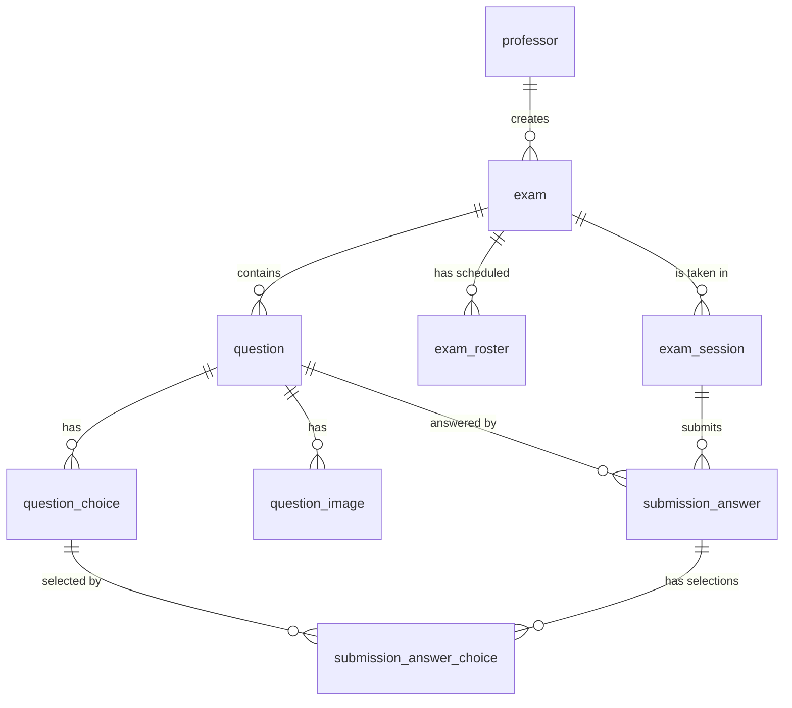

# DB Schema

DDL 위치: `backend/src/main/resources/db/migration/`

| Version | 파일 | 설명 |
|---|---|---|
| V1 | `V1__sprint1_schema.sql` | 초기 스키마 (8개 테이블) |
| V2 | `V2__drop_updated_at_triggers.sql` | `updated_at` 자동 갱신 트리거 제거 |
| V3 | `V3__multi_choice_submission.sql` | 객관식 다중 선택 지원 (Sprint 2) |

## 원칙

- PK: `BIGSERIAL`
- 외부 노출 ID는 별도 컬럼 (`exam_code`, `proctor_token`, `session_uuid`)
- 시간: `TIMESTAMPTZ` (UTC 저장)
- 삭제: Hard Delete + CASCADE
- 비밀번호: BCrypt
- 이미지: 파일 시스템 저장, DB는 메타데이터만

## 관계

```text
professor (1) ──< (N) exam (1) ──< (N) question (1) ──< (N) question_choice
                          │                  │                       │
                          │                  └──< (N) question_image │
                          │                                          │
                          ├──< (N) exam_roster                       │
                          │                                          │
                          └──< (N) exam_session (1)                  │
                                       │                             │
                                       └──< (N) submission_answer (1)│
                                                       │             │
                                                       └──< submission_answer_choice >── (N) question_choice
```

## 테이블

### professor

교수 계정. 1-1, 1-2.

### exam

시험. 1-3 ~ 1-5.

- `exam_code`: 6자리 unique. 충돌 시 재발급
- `proctor_token`: UUID. 감독관 링크 인증
- CHECK: `ends_at > starts_at`

### exam_roster

시험 응시 예정자 명단 (사전 등록용).

- UNIQUE (`exam_id`, `student_number`)

### question

문항. `question_type` IN ('SUBJECTIVE', 'MULTIPLE_CHOICE'). UNIQUE (`exam_id`, `display_order`).

- `correct_answer`: 주관식 정답 (채점 보조용)

### question_choice

객관식 선택지. `MULTIPLE_CHOICE`일 때만 row 존재.

- `is_correct`: 객관식 정답 여부 (자동 채점용, 다중 정답 허용)

### question_image

파일은 디스크, DB는 경로/메타. CASCADE 시 파일 삭제는 애플리케이션 책임 (`FileStorageService.deleteFile`).

### exam_session

응시 세션.

- `session_uuid`: 외부 노출용 (학생 인증 토큰으로도 사용)
- UNIQUE (`exam_id`, `student_number`): 한 학생 한 시험 1회 (재접속 시 동일 row 재사용)
- `status`: `'IN_PROGRESS' | 'SUBMITTED' | 'EXPIRED'`
- `total_score`: 자동 채점 + 교수가 부여한 총점

### submission_answer

학생이 제출한 단일 문항 답안.

- 주관식: `answer_text`에 저장
- 객관식: `submission_answer_choice` join 테이블에 다중 선택지 매핑
- `earned_score`: 해당 문항에서 얻은 획득 점수 (객관식은 자동 채점, 주관식은 교수 채점 후 갱신)
- UNIQUE (`exam_session_id`, `question_id`): 문항당 1행

> V3 변경: 단일 FK `selected_choice_id` 컬럼 + `answer_content_check` 제약 제거. 객관식 다중 선택 표현을 위해 별도 join 테이블 도입.

### submission_answer_choice

객관식 다중 선택지 매핑 (V3 신규).

- PK: (`submission_answer_id`, `choice_id`)
- CASCADE: 양쪽 부모(submission_answer, question_choice) 삭제 시 자동 정리
- 인덱스: `idx_submission_choice_choice (choice_id)` — 선택지 기준 역조회

---

## Redis Keys (Sprint 2)

DB와 별도로 응시 활성 lock과 답안 초안은 Redis에서 관리. fail-close 정책으로 Redis 장애 시 응시 자체를 차단.

| 키 | 자료구조 | TTL | 용도 |
|---|---|---|---|
| `exam:{examId}:active:{studentNumber}` | String (`sessionUuid`) | 30초 (heartbeat 10초 주기 갱신) | 동일 학번 동시접속 차단 + 30초 grace |
| `session:{sessionUuid}:draft` | Hash (`{questionId}` → JSON `{answerText, selectedChoiceIds}`) | `endsAt + 10분` | 작성 중 답안 초안 (재접속 복구용) |

제출 시 `submission_answer`로 flush한 뒤 두 키 모두 best-effort로 정리. 정리 실패 시 자연 만료에 의지.

---

## ERD



## 마이그레이션

Flyway. `V{N}__{설명}.sql`. 머지된 V는 절대 수정 금지, 항상 새 버전을 추가.

후속 sprint에서 다룰 항목:
- `event_log` (실시간 이벤트 수집, 백로그 13·14)
- 감독관 처리 기록 (확인함, 백로그 19)
- 사후 리포트 집계 테이블 (백로그 21)
