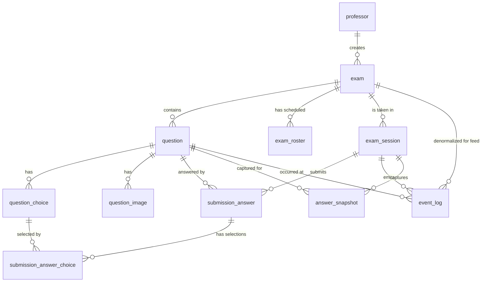

# DB Schema

DDL 위치: `backend/src/main/resources/db/migration/`

| Version | 파일 | 설명 |
|---|---|---|
| V1 | `V1__sprint1_schema.sql` | 초기 스키마 (8개 테이블) |
| V2 | `V2__drop_updated_at_triggers.sql` | `updated_at` 자동 갱신 트리거 제거 |
| V3 | `V3__multi_choice_submission.sql` | 객관식 다중 선택 지원 (Sprint 2) |
| V4 | `V4__realtime_events.sql` | 실시간 이벤트 로그 + 답안 스냅샷 (Sprint 3, 백로그 13·14·15) |

## 원칙

- PK: `BIGSERIAL`
- 외부 노출 ID는 별도 컬럼 (`exam_code`, `proctor_token`, `session_uuid`)
- 시간: `TIMESTAMPTZ` (UTC 저장)
- 삭제: Hard Delete + CASCADE
- 비밀번호: BCrypt
- 이미지: 파일 시스템 저장, DB는 메타데이터만

## 관계

```text
professor (1) ──< (N) exam (1) ──< (N) question (1) ──< (N) question_choice
                          │                  │                       │
                          │                  └──< (N) question_image │
                          │                                          │
                          ├──< (N) exam_roster                       │
                          │                                          │
                          ├──< (N) event_log >─────────── (0..1) question
                          │                                          │
                          └──< (N) exam_session (1)                  │
                                       │                             │
                                       ├──< (N) submission_answer (1)│
                                       │              │              │
                                       │              └──< submission_answer_choice >── (N) question_choice
                                       │
                                       ├──< (N) event_log
                                       │
                                       └──< (N) answer_snapshot ──── (N) question
```

## 테이블

### professor

교수 계정. 1-1, 1-2.

### exam

시험. 1-3 ~ 1-5.

- `exam_code`: 6자리 unique. 충돌 시 재발급
- `proctor_token`: UUID. 감독관 링크 인증
- CHECK: `ends_at > starts_at`

### exam_roster

시험 응시 예정자 명단 (사전 등록용).

- UNIQUE (`exam_id`, `student_number`)

### question

문항. `question_type` IN ('SUBJECTIVE', 'MULTIPLE_CHOICE'). UNIQUE (`exam_id`, `display_order`).

- `correct_answer`: 주관식 정답 (채점 보조용)

### question_choice

객관식 선택지. `MULTIPLE_CHOICE`일 때만 row 존재.

- `is_correct`: 객관식 정답 여부 (자동 채점용, 다중 정답 허용)

### question_image

파일은 디스크, DB는 경로/메타. CASCADE 시 파일 삭제는 애플리케이션 책임 (`FileStorageService.deleteFile`).

### exam_session

응시 세션.

- `session_uuid`: 외부 노출용 (학생 인증 토큰으로도 사용)
- UNIQUE (`exam_id`, `student_number`): 한 학생 한 시험 1회 (재접속 시 동일 row 재사용)
- `status`: `'IN_PROGRESS' | 'SUBMITTED' | 'EXPIRED'`
- `total_score`: 자동 채점 + 교수가 부여한 총점

### submission_answer

학생이 제출한 단일 문항 답안.

- 주관식: `answer_text`에 저장
- 객관식: `submission_answer_choice` join 테이블에 다중 선택지 매핑
- `earned_score`: 해당 문항에서 얻은 획득 점수 (객관식은 자동 채점, 주관식은 교수 채점 후 갱신)
- UNIQUE (`exam_session_id`, `question_id`): 문항당 1행

> V3 변경: 단일 FK `selected_choice_id` 컬럼 + `answer_content_check` 제약 제거. 객관식 다중 선택 표현을 위해 별도 join 테이블 도입.

### submission_answer_choice

객관식 다중 선택지 매핑 (V3 신규).

- PK: (`submission_answer_id`, `choice_id`)
- CASCADE: 양쪽 부모(submission_answer, question_choice) 삭제 시 자동 정리
- 인덱스: `idx_submission_choice_choice (choice_id)` — 선택지 기준 역조회

### event_log

실시간 이벤트 로그 (V4 신규, 백로그 13·14). 학생이 보낸 즉시/배치 이벤트 + 서버 파생 이벤트(`SUSPICIOUS_CHOICE_CHANGE`)를 한 테이블에 누적.

- PK `BIGSERIAL` (학부 스코프 단순성, Kafka 비채택으로 UUID 불필요)
- `exam_id`는 `exam_session_id`로 도달 가능하지만 **비정규화** — 감독관 이벤트 피드(백로그 18)와 사후 집계(백로그 21)에서 JOIN 회피
- `event_type` VARCHAR(40): 즉시(`PASTE`, `VISIBILITY_LOST`, `VISIBILITY_RESTORED`, `FULLSCREEN_EXIT`, `FULLSCREEN_ENTER`, `CAPTURE_SHORTCUT`, `WINDOW_BLUR`) / 배치(`KEYSTROKE`, `CHOICE_CHANGE`, `QUESTION_NAVIGATE`) / 파생(`SUSPICIOUS_CHOICE_CHANGE`)
- `occurred_at`: 클라이언트 발생 시각, `received_at`: 서버 수신 시각 (시계 차이 분석용)
- `duration_ms`: visibility/fullscreen 페어링 결과를 RESTORED/ENTER row에 기록. 미페어링이면 NULL
- `payload` JSONB: 이벤트 종류별 상세 (key, choice 변경 from/to, paste preview 등)
- 인덱스: `idx_event_session_time` (재생/상세), `idx_event_exam_time` (감독관 피드, DESC), `idx_event_type` (집계)

### answer_snapshot

답안 1분 스냅샷 (V4 신규, 백로그 14). 1분마다 클라이언트가 보낸 답안 상태를 append. 사후 재생(백로그 15)용.

- PK `BIGSERIAL`. append-only
- `answer_text` (주관식) / `selected_choice_ids BIGINT[]` (객관식) — 둘 다 NULL 가능 (해당 시점 미작성)
- 인덱스: `idx_snapshot_session_q_time` — 세션·문항별 시간순 조회
- Sprint 2 Redis draft와 역할 분리: draft는 "마지막 상태 덮어쓰기"(자동제출 백업), snapshot은 "시간순 누적"(재생용)

---

## Redis Keys

DB와 별도로 응시 활성 lock·답안 초안·주목도 점수·감독관 메타를 Redis에서 관리. lock과 draft는 fail-close 정책(장애 시 응시 차단), 주목도/감독관 키는 fail-open (장애 시 대시보드만 비어 보임).

| 키 | 자료구조 | TTL | 용도 | Sprint |
|---|---|---|---|---|
| `exam:{examId}:active:{studentNumber}` | String (`sessionUuid`) | 30초 (heartbeat 10초 주기 갱신) | 동일 학번 동시접속 차단 + 30초 grace | 2 |
| `session:{sessionUuid}:draft` | Hash (`{questionId}` → JSON `{answerText, selectedChoiceIds}`) | `endsAt + 10분` | 작성 중 답안 초안 (재접속 복구 + 자동 제출 백업) | 2 |
| `exam:{examId}:attention` | ZSET (member=`sessionUuid`, score=누적 시그널 수) | `endsAt + 1시간` | 주목도 정렬 (백로그 17). `ZREVRANGE`로 정렬 카드 목록 즉시 조회 | 3 |
| `exam:{examId}:active_sessions` | Hash (`{sessionUuid}` → JSON `{studentNumber, studentName, currentQuestionId, lastActivityAt}`) | `endsAt + 1시간` | 감독관 카드 즉시 렌더링 (백로그 16, 17) | 3 |
| `session:{sessionUuid}:signals` | Hash (`{signalType}` → 카운트) | `endsAt + 1시간` | 학생 상세 패널의 시그널별 카운트 즉시 응답 (백로그 17) | 3 |

제출 시 `submission_answer`로 flush한 뒤 sprint 2 키 두 개는 best-effort 정리. sprint 3 키는 시험 종료 후 1시간 자연 만료.

**주목도 점수 정책 (Sprint 3)**: 모든 의심 시그널 균등 +1점. `VISIBILITY_LOST` ~ `VISIBILITY_RESTORED` 페어는 RESTORED 도착 시점에 +1 (페어 = 1 사건). `SUSPICIOUS_CHOICE_CHANGE`(이탈 복귀 5초 내 객관식 변경)도 별도 +1. 레벨 임계 — `HIGH ≥ 4`, `MID ≥ 2`, `LOW ≥ 1`, `NORMAL = 0`.

---

## ERD



## 마이그레이션

Flyway. `V{N}__{설명}.sql`. 머지된 V는 절대 수정 금지, 항상 새 버전을 추가.

후속 sprint에서 다룰 항목:
- 감독관 처리 기록 (확인함, 백로그 19)
- 사후 리포트 집계 테이블 (백로그 21)
